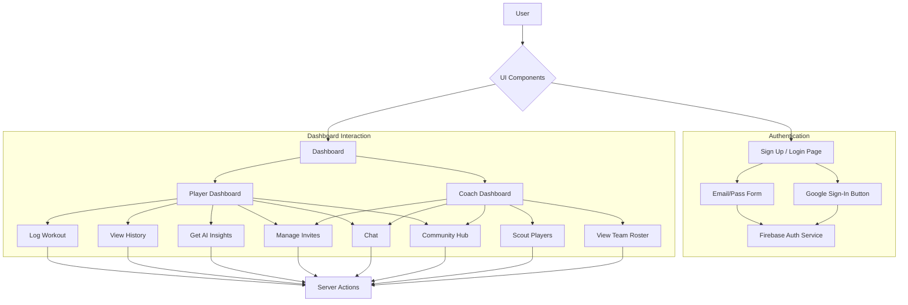
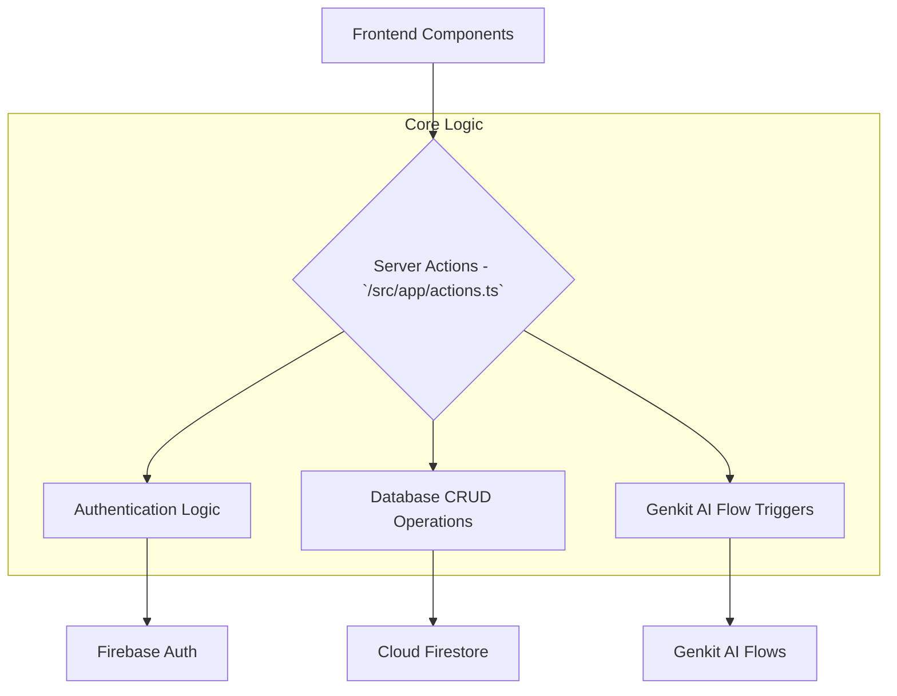

# OptiFit AI - System Architecture Flowchart

This document provides a figurative flowchart of the system architecture for the OptiFit AI application. It outlines the major components and the flow of data and interactions between them.

---

## 1. Frontend (Client-Side) - `Next.js / React`

*The user's browser, responsible for rendering the UI and handling user interactions.*



### Flow Description:

1.  **User Interaction**: The user interacts with the UI, which is built with **React** and **ShadCN UI** components.
2.  **Authentication**:
    *   On the **Login/Sign-Up pages**, user actions (e.g., submitting a form) trigger calls to the **Firebase Authentication** service.
    *   Firebase Auth securely handles the credential verification and returns a user session.
3.  **Dashboard**:
    *   Once authenticated, the user is redirected to their specific **Dashboard** (Player or Coach).
    *   All interactions on the dashboard (e.g., logging a workout, scouting a player, sending a message) call specific **Next.js Server Actions**.

---

## 2. Backend Logic - `Next.js Server Actions`

*Secure, server-side functions that run on the Next.js server. They act as the intermediary between the frontend and the backend services.*



### Flow Description:

1.  **Entry Point**: A component on the frontend calls a server action (e.g., `logWorkout`, `getPlayerAnalysis`).
2.  **Business Logic**: The server action contains the core business logic.
    *   It validates the input data (using Zod).
    *   It interacts with backend services like **Firebase Authentication** (for user management) and **Cloud Firestore** (for data storage).
    *   For AI-powered features, it calls the appropriate **Genkit AI Flow**.
3.  **Data Return**: The server action securely processes the request and returns a plain, serializable object back to the frontend component.

---

## 3. AI & Generative Features - `Genkit`

*The AI engine of the application, responsible for all generative tasks like analysis, recommendations, and content creation.*

```mermaid
graph TD
    A[Server Actions] --> B{Genkit AI Flows - `/src/ai/flows/*.ts`};

    subgraph "AI Processing"
        B --> C[Define Input/Output Schemas (Zod)];
        C --> D[Construct Prompt];
        D --> E[Google AI Platform (Gemini Models)];
    end

    E --> F[Structured JSON Output];
    F --> B;
    B --> A;
```

### Flow Description:

1.  **Invocation**: A server action calls a specific Genkit flow (e.g., `getPlayerAnalysis`).
2.  **Schema Definition**: The flow uses **Zod** to define the expected input and the desired output structure. This ensures type safety and predictable results.
3.  **Prompting**: The flow constructs a detailed prompt, injecting the user's data into a template.
4.  **Model Invocation**: Genkit sends this prompt to a **Google AI Model (e.g., Gemini)**. The model is instructed to return its response in a JSON format that matches the output Zod schema.
5.  **Structured Response**: The AI model processes the request and returns the structured data.
6.  **Return to Backend**: The Genkit flow passes this structured data back to the server action, which then sends it to the frontend.

---

## 4. Data Persistence & Authentication - `Firebase`

*The secure and scalable backend infrastructure for storing data and managing user identities.*

```mermaid
graph TD
    A[Server Actions] --> B{Firebase Services};

    subgraph "Services"
        B --> C[Cloud Firestore (Database)];
        B --> D[Firebase Authentication];
    end

    subgraph "Data Collections in Firestore"
        C --> E[Users];
        C --> F[Workouts];
        C --> G[Invites];
        C --> H[Conversations / Messages];
        C --> I[Posts / Comments];
    end
```

### Flow Description:

1.  **Cloud Firestore**:
    *   Acts as the primary NoSQL database for the application.
    *   Stores all user profiles, workout logs, chat messages, and other application data in a structured set of collections.
    *   Server actions perform all read/write operations on Firestore.
2.  **Firebase Authentication**:
    *   Provides a secure and independent service for managing user sign-up, sign-in, and sessions.
    *   It is the gatekeeper for application access. A user must be authenticated here before they can interact with the Firestore database via server actions.
